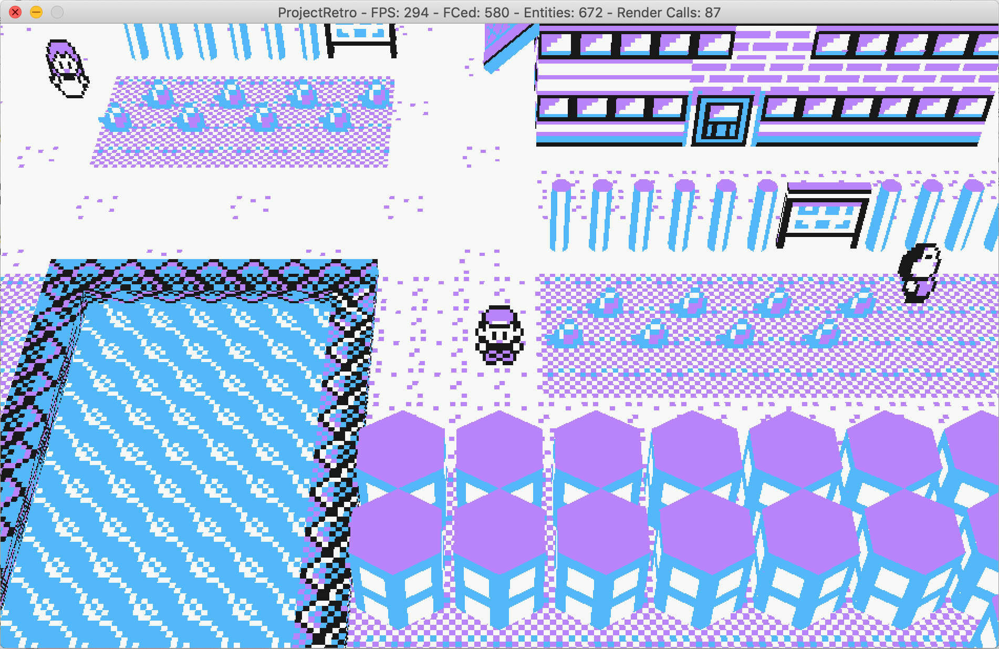
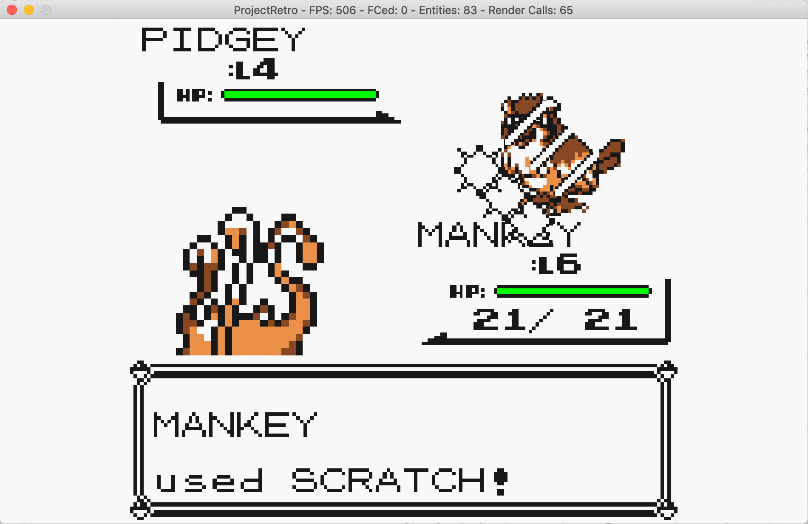

# ProjectRetro - A 3D Reinterpretation of Pokemon Yellow

## The Story
Having always had a blast replaying and remembering the joy that was to play Pokemon Yellow, I decided to give my own spin to the original game, by 3D-fying many elements of the Overworld maps, while emulating others as they appeared in the original game. 

The project originally started as an ECS tech test, with the intention being to discover how applicable a pure ECS framework would be in such a scenario (cloning an old Gameboy Color Game). This is the reason behind most of the ECS-oriented code sprinked across the repo. 

## Implementation
The project is being developed using C++ & SDL2 and is Windows/MacOS compatible. 

## Progress
At the time of writing, most of the basic flows that take place in the Overworld (i.e. not Battle) are in place, with the exception of most scripted events (e.g. Pikachu catching sequence). Pallet town, including all houses are mostly complete. Route 1 is complete in terms of models and geometry, however it is missing other NPCs.

Most of the work currently done revolves around the precise emulation of battle mechanics. This is the most tedious and time-consuming aspect of the project, from making sure Gen 1 specific battle bugs are present, to animation timing, and extraction of move animations.

## Running the project locally

### Windows

#### Dependencies
* Make sure you have CMake with version >= 3.1
* Make sure you have Visual studio 2015 installed. If a newer version is installed you will have to specify the respective generator inside make_project.bat.

#### Instructions
1) Clone the project
2) Navigate to the root of the project
3) Run the bat file make_project.bat
4) The generated project will reside inside project_files
5) Open the sln file with visual studio
6) Compile and run

### MacOS

#### Dependencies
* Make sure you have CMake with version >= 3.1
* The CMake will look for the SDL frameworks under /Users/{username}/Library/Frameworks: SDL2_image, SDL2_ttf, SDL2, SDL2_mixer

#### Instructions
1) Clone the project
2) Navigate to the root of the project
3) Run make_project.sh
4) The generated project will reside inside project_files
5) Open the xcodeproj file with XCode
6) Compile and run

